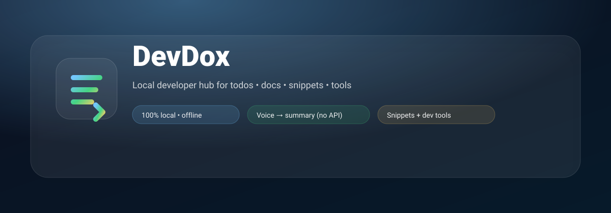
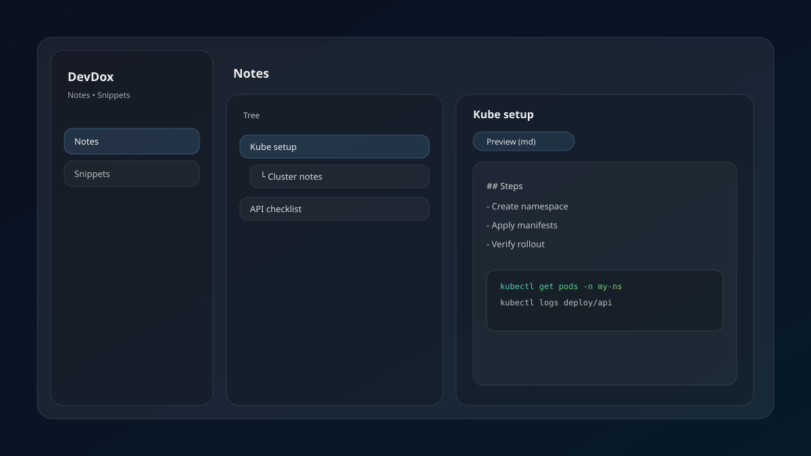
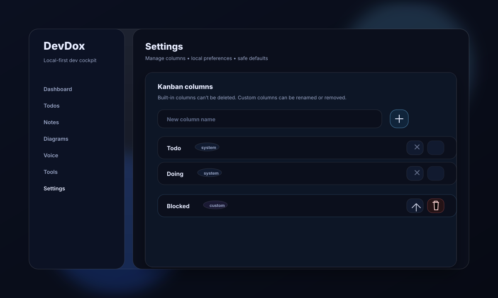
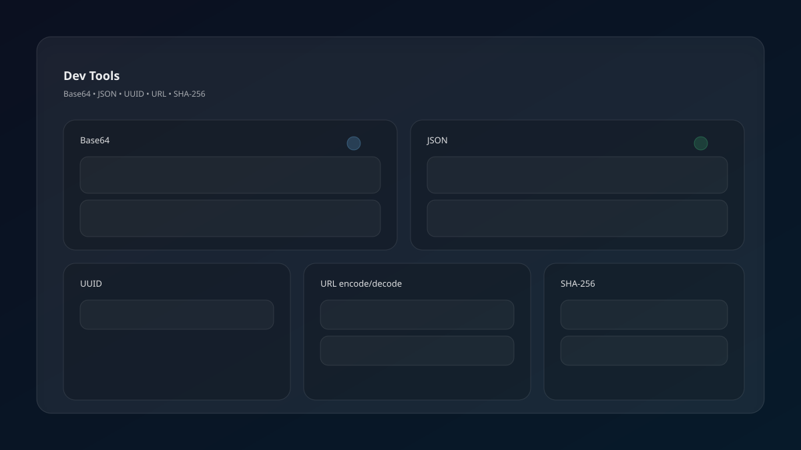

# DevDox



DevDox is a **local-first developer workstation**: keep your *todos*, *notes*, *snippets*, *voice docs* and *dev utilities* in one fast app.

## Live demo

- **Vercel**: `https://dev-dox-todo.vercel.app/`

- **Local-first**: everything stays in your browser (`localStorage`)
- **Notes tree**: organize docs as a tree and navigate quickly
- **Snippets**: syntax-highlighted with one-click copy
- **Voice → summary**: dictate documentation, summarize, and save (no API keys)
- **Dev tools**: Base64, JSON formatter, UUID, URL encode/decode, SHA-256
- **Diagrams**: Mermaid + freehand canvas (fullscreen supported)
- **Pomodoro**: focus timer + completion sound + OS notifications
- **Global search**: Ctrl/Cmd+K command palette
- **Backups**: export/import your full session + daily backup reminders
- **Themes**: dark/light mode

## Screenshots

### Todos (Jira-style Kanban or checklist style)


### Notes (tree + preview)



### Settings (manage columns)



### Dev tools



## Quickstart (local)

```bash
npm install
npm run dev
```

Open the URL that Vite prints.

## Data & privacy

DevDox stores data in your browser under:

- `localStorage` key: `devdoc:v1`

**Security note**: Don’t store passwords, secrets, or sensitive personal data. This app is designed for local notes and workflow—not secret management.

To reset: clear the site data (or delete that key).

## Contributing

Contributions are welcome — especially:

- New dev tools (JWT decoder, cron parser, regex tester, time converters, etc.)
- Better editor/preview experiences for notes
- More snippet language packs / templates
- UX polish + keyboard shortcuts

### Development

```bash
cd devdoc
npm install
npm run dev
```

### Build

```bash
npm run build
```

## Support the project

If DevDox saves you time, you can support development here:

- **Donate**: `https://buymeacoffee.com/YOUR_HANDLE`

Replace `YOUR_HANDLE` with your username (or tell me your preferred link and I’ll wire it in everywhere).
